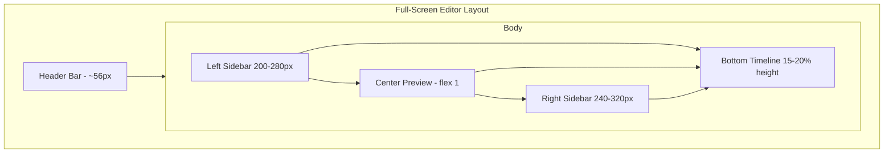

# Clipchamp-Style Video Editor - Comprehensive Plan

## Current State vs Target

The existing editor ([frontend/pages/editor/[id].vue](frontend/pages/editor/[id].vue)) uses a form-based layout: left sidebar with grouped inputs (Timeline, Transform, Text, Media Overlays, Presets), center video preview, and right status panel. There is no visual timeline, no drag-and-drop, no icon-based navigation, and no multi-track editing. The backend ([backend/app/services/video_editor.py](backend/app/services/video_editor.py)) already supports trim, crop, rotate, color, fades, text overlay, image/audio insertion, and export.

This plan defines a Clipchamp-inspired redesign: modular 5-panel layout, dark theme with accent colors, icon-driven navigation, thumbnail grids, visual timeline with tracks, and contextual property panels.

---

## 1. High-Level Layout and Space Philosophy

### 1.1 Overall Structure




### 1.2 Space Allocation (Approximate)


| Panel          | Width/Height              | Purpose                                     |
| -------------- | ------------------------- | ------------------------------------------- |
| Header         | 100% x 56px               | Global controls, project name, export       |
| Left Sidebar   | 200-280px x remaining     | Asset library navigation + content browsing |
| Center Preview | flex: 1 (largest)         | Video output, primary focus                 |
| Right Sidebar  | 240-320px x remaining     | Contextual properties for selected element  |
| Timeline       | 100% x 15-20% of viewport | Multi-track sequencing, playhead, zoom      |


### 1.3 Design Principles

- **Central Focus:** Center preview gets the largest share; video is the primary output.
- **Modular Panels:** Clear visual separators (borders, background shades) between panels.
- **Icon-Driven Navigation:** Both sidebars use narrow vertical icon strips to conserve horizontal space.
- **Thumbnail-First Browsing:** Assets and effects use visual thumbnails in grids (2-3 columns).
- **Contextual Right Panel:** Content changes based on selection (clip, text, shape, transition).
- **Dark Theme:** Background `#1a1a1a` to `#252525`; accent color (e.g. purple `#8b5cf6`) for active states.

---

## 2. Header Bar - UI Components and Specifications

### 2.1 Layout

- **Height:** 56px fixed
- **Background:** `bg-surface-900` or `#1e1e1e`
- **Border:** 1px bottom `border-surface-800`
- **Padding:** `px-4 lg:px-6`, `flex items-center justify-between`

### 2.2 Components (Left to Right)


| Component        | Type                | Specs                                                  | Functionality                                    |
| ---------------- | ------------------- | ------------------------------------------------------ | ------------------------------------------------ |
| Hamburger Menu   | Icon button         | 3 horizontal lines, 24x24px                            | Toggle left sidebar visibility (collapse/expand) |
| Application Logo | Text/Icon           | "Clipchamp" or app name + icon                         | Branding, click to dashboard                     |
| Project Title    | Editable text input | Inline editable, pencil icon on hover                  | Rename current project; auto-save                |
| Cloud Sync Icon  | Status icon         | Cloud + checkmark or arrow                             | Indicate save/auto-save status                   |
| Undo             | Icon button         | Curved left arrow                                      | Undo last action; disabled when nothing to undo  |
| Redo             | Icon button         | Curved right arrow                                     | Redo last undone action                          |
| Upgrade Button   | Button              | Gold/diamond icon + "Upgrade"                          | Link to premium or subscription                  |
| Export Button    | Primary CTA         | Purple background, up-arrow + "Export", dropdown caret | Open export modal/dropdown (resolution, format)  |
| Help Icon        | Icon button         | Question mark                                          | Open help docs or tutorials                      |
| Feedback Icon    | Icon button         | Speech bubble                                          | Open feedback form                               |
| Profile/Account  | Avatar              | Circular, initials or image                            | Account, settings, sign out                      |
| Window Controls  | OS-native           | Minimize, maximize, close                              | Desktop app style (if applicable)                |


---

## 3. Left Sidebar - Asset Library

### 3.1 Structure

- **Width:** 200-280px (collapsible to ~60px icon-only via hamburger)
- **Layout:** Two sub-panels
  - **Navigation column (left):** ~56px wide, vertical icon + text list
  - **Content area (right):** Remaining width, scrollable

### 3.2 Navigation Items (Icon + Label)


| Item            | Icon                              | Functionality                                            |
| --------------- | --------------------------------- | -------------------------------------------------------- |
| Your media      | Stacked media / folder            | Import, list, manage user-uploaded videos, images, audio |
| Record & create | Camera + plus                     | Screen recording, webcam, voiceover                      |
| Text            | Large "T"                         | Add text overlays, titles, lower thirds, styles          |
| Music           | Musical note                      | Stock music, sound effects, import audio                 |
| Stock video     | Film reel                         | Browse/add royalty-free stock video                      |
| Stock images    | Picture frame                     | Browse/add royalty-free stock images                     |
| Templates       | Grid of 4 squares                 | Pre-designed video templates (YouTube, Instagram, etc.)  |
| Graphics        | Shapes (square, circle, triangle) | Annotations, figures, shapes, overlays                   |
| Transitions     | Overlapping arrows                | Transitions between clips (fade, wipe, etc.)             |
| Brand kit       | Paint palette                     | Brand logos, colors, fonts                               |
| Frames          | Picture frame                     | Decorative borders                                       |
| Stickers        | Koala/emoji icon                  | Animated/static stickers                                 |


### 3.3 Content Area - "Your media"

- **Import media button:** Large purple button with "Import media" + dropdown (video, image, audio)
- **Media thumbnails:** Grid 2-3 columns; each shows thumbnail, duration badge, checkmark when added
- **Search:** "Search media" input with magnifying glass
- **Filter/Sort:** Icon for filter/sort options

### 3.4 Content Area - "Text"

- **Plain text:** Large black preview with "Text" label; drag to timeline
- **Text styles:** Grid of smaller previews (CREATOR, Button, Bubble, RETRO, etc.)
- **"See all"** link to expand styles

### 3.5 Content Area - "Transitions"

- **Search:** "Search transitions"
- **Categories:** Fades & blurs, Tiles, Wipes, etc.
- **Thumbnails:** Each transition with visual preview
- **Onboarding:** "Drag a transition between two clips on the timeline"

### 3.6 Content Area - "Stock images"

- **Tabs:** "Your media" | "Images"
- **Search:** "Search images"
- **Categories:** Paper, Scenery, Working, Orange, Blue, etc.
- **Grid:** 3 columns of square thumbnails
- **Arrow (">")** per row: expand category

### 3.7 Content Area - "Filters" (when right panel shows Filters)

- Mirrored in left when filters are active; otherwise Filters live in right panel.

### 3.8 Content Area - "Templates"

- **Sub-categories:** All templates, YouTube, Instagram, Intro & outro, Gaming, Corporate
- **Thumbnails:** Each category with representative image

### 3.9 Space Usage Notes

- Navigation: icons ~24px, labels truncate; active item has purple background
- Content: scrollable, padding `p-4`; thumbnails with consistent aspect ratio (e.g. 16:9 or 1:1)
- Categories: section headers with `text-sm font-medium`, `mb-2`

---

## 4. Center Panel - Video Preview

### 4.1 Dimensions

- **Flex:** `flex-1` (largest area)
- **Background:** `#0a0a0a` or `bg-black`
- **Aspect:** Maintain video aspect ratio; letterbox/pillarbox as needed

### 4.2 Video Player

- **Element:** HTML5 `<video>` or canvas for composited preview
- **Play overlay:** Large semi-transparent play button when paused
- **Crop/Resize overlay (when clip selected):** Purple dashed lines with circular handles at corners and midpoints

### 4.3 Video Aspect Ratio and Resize (Key Feature)

Changing the output aspect ratio and resizing the video is a primary use case (e.g. TikTok 9:16, YouTube 16:9, Instagram 1:1).

- **Aspect ratio presets:** Dropdown or buttons for common ratios:
  - 16:9 (YouTube, landscape)
  - 9:16 (TikTok, Reels, Shorts – vertical)
  - 1:1 (Instagram square)
  - 4:5 (Instagram portrait)
  - 4:3, 21:9 (cinematic)
  - Custom (manual width x height)
- **Fit options (when changing aspect):**
  - **Fit:** Letterbox/pillarbox to fit entire frame; may show black bars
  - **Fill:** Crop to fill; no black bars; may lose edges
  - **Stretch:** Distort to fill (use sparingly)
- **Crop overlay:** Purple dashed frame with corner and midpoint handles; drag to reposition crop area within source
- **Canvas size:** Export dimensions (e.g. 1920x1080, 1080x1920); updates when aspect ratio changes
- **Right panel:** When video clip selected, show "Aspect ratio" and "Fit" controls

### 4.4 Top-Right Overlay Controls (on preview)


| Control     | Icon            | Functionality                          |
| ----------- | --------------- | -------------------------------------- |
| Crop        | Scissors        | Enter crop mode; adjust framing        |
| Fit/Fill    | Square + arrows | Fit, Fill, Original aspect             |
| Rotate/Flip | Circular arrows | Rotate or flip                         |
| More        | Three dots      | Additional options (e.g. replace clip) |


### 4.5 Inserting Images and Moving Them on the Video Frame

- **Insert image:** From left sidebar (Your media, Stock images, Brand kit) – drag image to timeline (graphics track) or double-click to add at playhead
- **On-canvas placement:** When image overlay is selected, it appears on the center preview with:
  - **Move:** Drag the image anywhere within the video frame; position persisted (x, y as pixels or percentage)
  - **Resize handles:** White circular handles at corners and midpoints; drag to scale (maintain or break aspect ratio via Shift)
  - **Rotation handle:** Circular arrow below image; drag to rotate
  - **Bounds:** Image constrained to stay within frame (or allow partial off-frame for creative effect)
- **Right panel (Image selected):** Position (X, Y), Width, Height, Scale %, Lock aspect ratio toggle
- **Timeline:** Image clip on graphics track; trim start/end to control when it appears/disappears

### 4.6 Playback Controls Bar (below preview)

- **Position:** Directly below video, `p-3`, `border-t border-surface-800`
- **Layout:** Horizontal flex, centered


| Control       | Icon/Spec           | Functionality                 |
| ------------- | ------------------- | ----------------------------- |
| Time display  | "0:00.00 / 0:07.05" | Current time / total duration |
| Loop          | Circular arrow      | Toggle loop playback          |
| Skip to start | Double left arrow   | Jump to start                 |
| Rewind 5s     | Single left + "5s"  | Jump back 5 seconds           |
| Play/Pause    | Triangle / two bars | Toggle playback               |
| Forward 5s    | Single right + "5s" | Jump forward 5 seconds        |
| Skip to end   | Double right arrow  | Jump to end                   |
| Volume        | Speaker + slider    | Playback volume               |
| Fullscreen    | Four outward arrows | Toggle fullscreen             |
| Split         | Scissors            | Split at playhead             |
| Delete        | Trash can           | Delete selected clip          |


### 4.7 Mini Timeline / Scrubber (above main timeline)

- **Thin purple bar** with playhead (white vertical line + circular handle)
- **Time label** at playhead (e.g. "07.05s")
- **Functionality:** Scrubbing; synced with main timeline playhead

---

## 5. Right Sidebar - Properties / Adjustments Panel

### 5.1 Structure

- **Width:** 240-320px
- **Layout:** Vertical icon strip (right edge) + content area (left)
- **Contextual:** Content changes based on selected element (video clip, text, shape, transition)

### 5.2 Navigation Tabs (Vertical Icons + Labels)


| Tab            | Icon                        | Content when active                                          |
| -------------- | --------------------------- | ------------------------------------------------------------ |
| Captions       | CC                          | Add/edit captions, import SRT                                |
| Audio          | Speaker                     | Volume, mute, audio effects                                  |
| Fade           | Overlapping gradient shapes | Fade in/out sliders + numeric inputs                         |
| Filters        | Three circles               | Filter thumbnails (None, Retro, Orange and teal, etc.)       |
| Effects        | Magic wand                  | Visual effects (glitch, blur, etc.)                          |
| Adjust colours | Half-filled color circle    | Brightness, contrast, saturation, temperature sliders        |
| Speed          | Stopwatch                   | Speed slider, presets (0.1x, 1x, 2x, 4x, 16x)                |
| Shape          | Overlapping square/circle   | Colour picker, outline toggle (when shape selected)          |
| Image          | Picture icon                | Position X/Y, Size, Rotation, Duration (when image selected) |
| Aspect ratio   | Ratio icon                  | Presets, fit/fill, crop overlay (when video clip selected)   |


### 5.3 Fade Panel

- **Fade in:** Label, numeric input (e.g. "0 s"), horizontal slider
- **Fade out:** Same structure
- **Sliders:** Purple track, white handle; min 0, max e.g. 5s

### 5.4 Filters Panel

- **Search:** "Search filters"
- **Grid:** 2 columns of filter thumbnails
- **Examples:** None, Retro, Orange and teal, Bold and blue, Golden hour, Vibrant vlogger, Purple undertone, Winter sunset, 35mm, Contrast, Autumn, Winter
- **Selection:** Purple border on selected

### 5.5 Speed Panel

- **Header:** "Speed" + speedometer icon + numeric input "1" + reset icon
- **Slider:** Horizontal, labeled "1x" at handle
- **Presets:** 0.1x, 1x, 2x, 4x, 16x

### 5.6 Shape Panel (when shape selected)

- **Header:** "Shape" + copy icon + layer icon
- **Name:** "Shape 1"
- **Colour:** Label + circular swatch + color picker
- **Outline:** Toggle switch (on/off)

### 5.7 Image Panel (when image overlay selected)

- **Header:** "Image" + copy icon + layer icon
- **Position:** X and Y numeric inputs (pixels from top-left)
- **Size:** Width, Height (px) or Scale (%) with lock aspect ratio toggle
- **Rotation:** Degrees input or slider
- **Duration:** Start time, End time (from timeline trim)

---

## 6. Bottom Timeline Panel

### 6.1 Dimensions

- **Height:** 15-20% of viewport (e.g. 180-220px)
- **Width:** 100%
- **Background:** `bg-surface-900`
- **Border:** 1px top `border-surface-800`

### 6.2 Timeline Toolbar (top-left)


| Tool       | Icon                    | Functionality                   |
| ---------- | ----------------------- | ------------------------------- |
| Split/Cut  | Scissors                | Split selected clip at playhead |
| Delete     | Trash can               | Delete selected                 |
| Duplicate  | Two overlapping squares | Duplicate selected clip         |
| Magic wand | (Optional)              | AI enhancements or quick edits  |


### 6.3 Timeline Ruler

- **Time markers:** 0:02, 0:04, 0:06, 0:08, etc.
- **Playhead:** Vertical white line, full height; circular handle at top
- **Duration indicator:** e.g. "07.05s" below playhead

### 6.4 Tracks (Vertical Stack)

- **Track types:** Video, Graphics/Text, Audio
- **Video track:** Thumbnails in sequence; purple border on selected clip; volume icon on clip
- **Transition indicator:** Small purple block between clips
- **Graphics track:** Bar labeled "Square" (or element name); trim handles at ends
- **Audio track:** Waveform visualization, label (e.g. "Sundowner (outro)")

### 6.5 Timeline Zoom Controls (bottom-right) – Critical for Precision Editing

- **Minus button:** Zoom out timeline (show more duration in view; e.g. 1x → 0.5x scale)
- **Plus button:** Zoom in timeline (show less duration; finer granularity; e.g. 1x → 2x scale)
- **Fit to screen:** Two arrows pointing inwards – auto-scale timeline so entire project fits in view
- **Zoom range:** e.g. 10% (overview) to 400% (frame-accurate trimming)
- **Scroll wheel:** Optional: Ctrl+scroll to zoom timeline when hovered
- **Horizontal scrollbar:** At very bottom for long projects; appears when zoomed in
- **Zoom indicator:** Optional label (e.g. "100%" or "2x") near controls

### 6.6 Clipping and Trimming on the Timeline

- **Trim handles:** When a clip is selected, vertical handles appear at the left and right edges of the clip on the timeline
- **Drag to trim:** Drag left handle to change in-point (trim start); drag right handle to change out-point (trim end)
- **Visual feedback:** Cursor changes to resize icon when hovering over handles; clip preview updates in real time
- **Numeric trim:** Right panel shows "Trim start" and "Trim end" (seconds) when clip selected; editable inputs
- **Split (clip):** Scissors tool splits the selected clip at the playhead position; produces two clips
- **Clip out:** Remove segment between two points (existing backend `clip_out` op)
- **Prevent invalid trim:** Trim end must be > trim start; min clip duration e.g. 0.1s
- **Ripple/overwrite mode:** Optional toggle for ripple edit (shift following clips) vs overwrite

### 6.7 Clip Representation

- **Visual:** Rectangular segment with thumbnail strip or solid color
- **Selected:** Purple border, trim handles visible at edges
- **Draggable:** Drag horizontally to reorder or change position; drag edges to trim
- **Context menu:** Right-click for duplicate, delete, split, etc.

---

## 7. Feature Enumeration (Complete)

### 7.1 Project & File

- Create/rename project
- Auto-save / cloud sync indicator
- Import media (video, image, audio)
- Export video (resolution, format, bitrate)
- Undo / redo (history stack)

### 7.2 Timeline

- Multi-track (video, graphics/text, audio)
- Add/remove tracks
- Drag clips to reorder
- **Clipping and trimming:** Trim clips by dragging left/right edge handles; numeric trim start/end in right panel; split at playhead; clip-out (remove segment)
- Split clip at playhead
- Delete clip
- Duplicate clip
- Transition between clips (drag from library)
- **Zoom timeline in/out:** Plus/minus buttons, fit-to-screen, optional Ctrl+scroll; zoom range 10%–400%
- Fit timeline to screen
- Scrub/seek via playhead
- Ruler with time markers

### 7.3 Playback

- Play/pause
- Skip to start/end
- Rewind/forward 5 seconds
- Previous/next frame
- Loop toggle
- Volume control
- Fullscreen preview
- Current time / total duration display

### 7.4 Transform (per clip)

- Crop (interactive handles or numeric)
- Rotate
- Flip (horizontal/vertical)
- **Aspect ratio (key):** Presets (16:9, 9:16, 1:1, 4:5, etc.); fit/fill/stretch; crop overlay for repositioning
- Resize/fit (fit, fill, original)
- Canvas size (export dimensions)
- Position (for overlays)

### 7.4b Image Overlays – Insert, Move, Resize

- Insert images from media library, stock, or brand kit onto graphics track
- **Move:** Drag image anywhere on video frame; position (x, y) persisted
- **Resize:** Corner/midpoint handles; lock aspect ratio; scale % or pixel dimensions
- **Rotate:** Handle below image; degrees
- Right panel: Position, Size, Rotation, Duration

### 7.5 Effects & Color

- Filters (preset thumbnails)
- Adjust colours (brightness, contrast, saturation, temperature)
- Fade in / fade out
- Visual effects (e.g. glitch, blur)

### 7.6 Overlays

- Text (plain + styles)
- Images (branding, stickers)
- Shapes (rectangle, circle, etc.) with colour and outline
- Graphics (annotations, figures)

### 7.7 Audio

- Volume per track
- Mute
- Fade in/out
- Insert music/SFX
- Waveform display

### 7.8 Captions

- Add captions
- Edit captions
- Import SRT
- Sync with playback

### 7.9 Assets

- Your media (uploaded)
- Record & create (screen, webcam)
- Stock video / images
- Templates (YouTube, Instagram, etc.)
- Transitions
- Brand kit (logos, fonts, colors)
- Stickers, frames, backgrounds

---

## 8. Implementation Phases

### Phase 1: Layout & Shell

- New full-screen editor layout: header, left sidebar (collapsible), center, right sidebar, timeline
- Dark theme variables; accent color (e.g. purple)
- Responsive breakpoints: collapse sidebars on smaller screens
- Route: `/editor/:id` (reuse existing)

### Phase 2: Header & Navigation

- Header components (logo, project title, undo/redo, export, profile)
- Left sidebar: icon navigation strip + content area shell
- Right sidebar: tab navigation + content area shell
- Wire project title to state; export to existing backend `export_video` op

### Phase 3: Center Preview & Playback

- Video player component with controls
- Playhead sync between preview and timeline
- Playback controls bar (play, seek, volume, fullscreen)
- Integrate with existing `previewUrl` / video source

### Phase 4: Timeline Foundation

- Timeline component: ruler, playhead, zoom controls (in/out, fit-to-screen)
- Multi-track data model (video, graphics, audio)
- Clip components: visual representation, selection state
- Clipping and trimming: drag edge handles to trim; split at playhead
- Drag-and-drop for reorder (client-side state; backend ops applied on export)

### Phase 5: Left Sidebar Content and Image Overlays

- Your media: import button, media grid, wire to `api.videos.list` and `api.branding.list`
- Text: plain text + style grid; add-to-timeline action
- Image insertion: drag from media/stock/brand kit to timeline or canvas
- On-canvas image manipulation: move (drag), resize (handles), rotate (handle)
- Transitions: category list + thumbnails; drag-between-clips UX
- Templates: category grid; apply template flow
- Graphics: shapes, stickers (use branding assets initially)

### Phase 6: Right Sidebar - Contextual Properties

- Fade: sliders + numeric inputs; wire to `fade_in_out` op
- Filters: thumbnail grid; wire to `adjust_color` or new filter op
- Speed: slider + presets; wire to `set_clip_speed`
- Shape: colour, outline; wire to overlay/sticker ops
- Image: position X/Y, size, rotation, duration; wire to `insert_image` / `add_sticker`
- Aspect ratio: presets, fit/fill, crop overlay; wire to `crop_clip` + `set_canvas_size` / `export_video`
- Captions, Audio: placeholder panels first, then backend integration

### Phase 7: Backend Extensions

- Project/state persistence (optional: new `editor_projects` table)
- Batch edit operations (combine multiple ops into one export)
- Transition support (if not yet in `video_editor.py`)
- Filter presets as named `adjust_color` configs

### Phase 8: Polish

- Onboarding tooltips (e.g. "Drag transition between clips")
- Keyboard shortcuts (space play/pause, delete, split)
- Loading states, error handling
- Accessibility (focus management, ARIA)

---

## 9. Key Files to Create or Modify


| File                                                                         | Action                                             |
| ---------------------------------------------------------------------------- | -------------------------------------------------- |
| [frontend/pages/editor/[id].vue](frontend/pages/editor/[id].vue)             | Replace with new 5-panel layout                    |
| `frontend/components/editor/`                                                | New directory for editor components                |
| `EditorHeader.vue`                                                           | Header bar                                         |
| `EditorLeftSidebar.vue`                                                      | Left asset panel                                   |
| `EditorRightSidebar.vue`                                                     | Right properties panel                             |
| `EditorPreview.vue`                                                          | Center video + playback controls                   |
| `EditorTimeline.vue`                                                         | Bottom timeline                                    |
| `EditorTrack.vue`                                                            | Single track                                       |
| `EditorClip.vue`                                                             | Clip component                                     |
| `frontend/composables/useEditorState.ts`                                     | Central editor state (tracks, selection, playback) |
| [backend/app/services/video_editor.py](backend/app/services/video_editor.py) | Add transition ops, filter presets if needed       |


---

## 10. Data Model for Editor State (Client)

```typescript
interface EditorProject {
  id: string
  videoId: string
  name: string
  tracks: EditorTrack[]
  duration: number
  selectedClipId: string | null
  playheadTime: number
  timelineZoom: { scale: number; scrollLeft: number }  // 10%–400%
}

interface EditorTrack {
  id: string
  type: 'video' | 'graphics' | 'audio'
  clips: EditorClip[]
}

interface EditorClip {
  id: string
  type: 'video' | 'text' | 'image' | 'shape' | 'audio'
  sourceId?: string  // video_id or asset path
  startTime: number
  duration: number
  trimStart?: number
  trimEnd?: number
  effects?: { fadeIn?: number; fadeOut?: number; speed?: number; filter?: string }
  // For video clips: aspect ratio and fit
  aspectRatio?: string  // "16:9" | "9:16" | "1:1" | "4:5" | etc.
  fitMode?: 'fit' | 'fill' | 'stretch'
  cropRegion?: { x: number; y: number; width: number; height: number }
  // For image overlays: position, size, rotation
  position?: { x: number; y: number }
  size?: { width: number; height: number } | { scalePercent: number }
  rotation?: number
  lockAspectRatio?: boolean
}

interface EditorTimelineZoom {
  scale: number  // 0.1 to 4 (10% to 400%)
  scrollLeft: number
}
```

This state drives the timeline UI; on export, the app translates it into a sequence of backend `editorOps` calls (or a new batch API) to produce the final video.

---

## 11. Summary

This plan specifies every UI component, feature, and space allocation for a Clipchamp-like editor. Implementation should proceed in phases: layout shell first, then header and navigation, center preview, timeline, left sidebar content, right sidebar properties, backend extensions, and polish. The existing backend ops provide a solid foundation; the main work is frontend architecture and UX to match Clipchamp's modular, thumbnail-driven, multi-track editing experience.