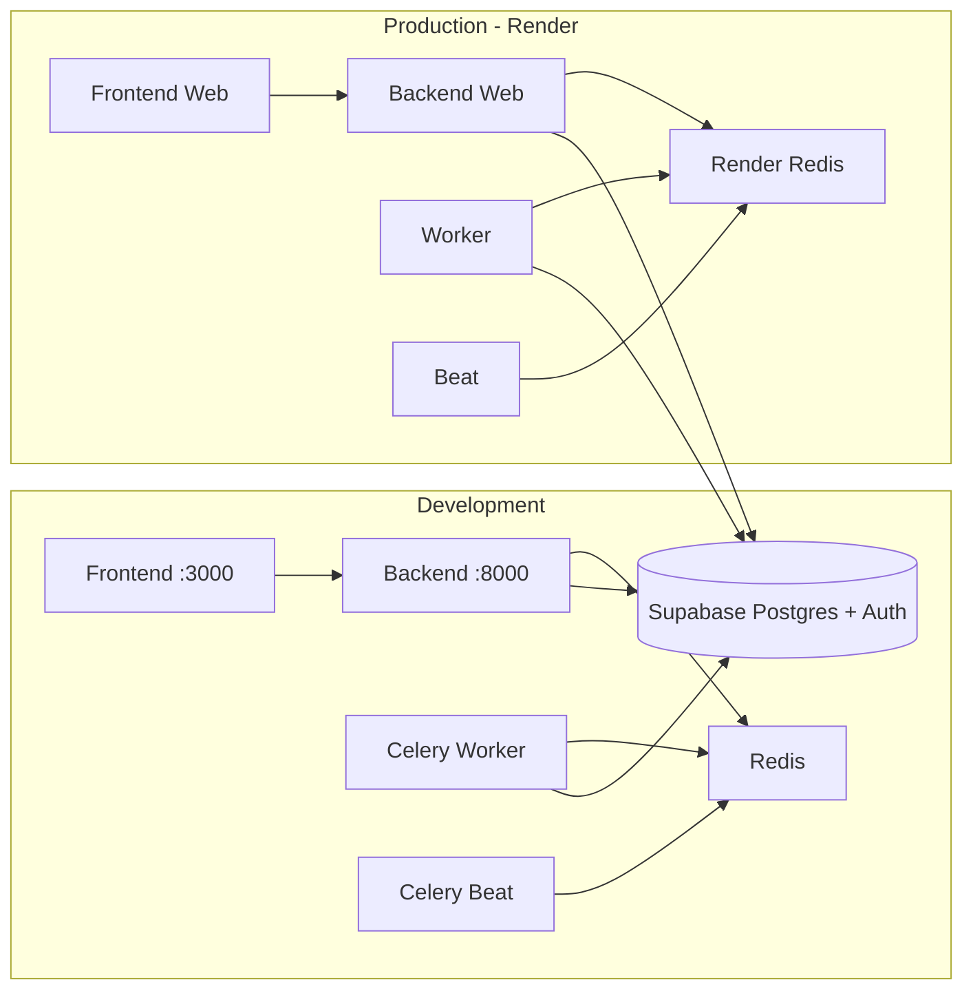

# Infrastructure: Supabase-only, Dev/Prod split, Render-ready

## Current state

- **docker-compose.yml**: nginx, frontend, backend, celery-worker, celery-beat, redis (no postgres; DB from backend/.env).
- **docker-compose.prod.yml**: still has postgres; hardcoded `DATABASE_URL=postgresql://...@postgres`.
- **render.yaml**: Supabase-only (no Render DB); frontend, backend, worker, beat, Redis.
- **Celery/Redis**: used for video analysis, thumbnail generation, publish tasks; required for those features.

## Target architecture

- **Development**: Local Docker (or local processes). Only Supabase for DB/auth; no nginx, no postgres container.
- **Production**: Render only. Same services (frontend, backend, worker, beat, Redis); Supabase for DB/auth.

---

## 1. Development: simplify Docker (Supabase-only, no nginx)

**File: [docker-compose.yml**](docker-compose.yml)

- **Remove** the `nginx` service. Devs will use:
  - Frontend: `http://localhost:3000`
  - Backend API: `http://localhost:8000`
- **Keep**: frontend, backend, redis, celery-worker, celery-beat (needed for video/publish).
- **Ensure** no postgres; all services get `DATABASE_URL` from `backend/.env` (Supabase connection string). Do not override `DATABASE_URL` in `environment`; use `env_file` only (or pass through from host).
- **Frontend**: set `NUXT_PUBLIC_API_URL=http://localhost:8000/api/v1` in compose so the app talks to the backend without nginx.
- Add a short comment at the top: "Development only. Database = Supabase (set in backend/.env). Production = Render."

Result: 5 services (frontend, backend, redis, celery-worker, celery-beat).

---

## 2. Production-like local: Supabase-only, no postgres

**File: [docker-compose.prod.yml**](docker-compose.prod.yml)

- **Remove** the `postgres` service and `postgres-data` volume.
- **Remove** all `depends_on: postgres` and any `DATABASE_URL` that points at a postgres container.
- **Use env from host**: `env_file: backend/.env` and/or pass `DATABASE_URL`, `SUPABASE_*` via environment (e.g. `DATABASE_URL: ${DATABASE_URL}`) so production-like local runs use Supabase.
- **Optional**: keep nginx in this file only if you want to test "single entrypoint" locally; otherwise remove nginx here too for consistency with Render (Render exposes frontend and backend separately).

Result: No postgres anywhere; production-like stack (frontend, backend, worker, beat, redis, optionally nginx) using Supabase.

---

## 3. Env and config: development vs production

**Backend**

- **File: [backend/app/core/config.py**](backend/app/core/config.py)
  - Keep loading from `.env` (dev). For production, Render injects env; no code change required.
  - **CORS**: ensure `CORS_ORIGINS` includes production frontend URL(s). Prefer config from env, e.g. `CORS_ORIGINS` from a comma-separated env var (e.g. `CORS_ORIGINS=https://social-media-ai-frontend.onrender.com,https://your-custom-domain.com`) with fallback to current list so Render can set it.
- **File: [backend/env.example**](backend/env.example)  
  - Add a short "Development" vs "Production" section: dev uses local Redis URL (or Docker Redis hostname when running in compose); prod uses Render Redis URL and Supabase DB; never commit real secrets.

**Frontend**

- **File: [frontend/env.example**](frontend/env.example)  
  - Document: development `NUXT_PUBLIC_API_URL=http://localhost:8000/api/v1`; production set in Render to backend URL + `/api/v1`.

**Root**

- **File: [.env.docker.example**](.env.docker.example)  
  - Already Supabase-focused; add one line that `DATABASE_URL` must be Supabase connection string and that this is for dev/docker; production env is set in Render.

No need for separate `.env.development` / `.env.production` in repo; development uses local `.env` files, production uses Render Environment.

---

## 4. Production-ready code and safety

- **Backend**
  - **DEBUG**: already read from env; ensure Render sets `DEBUG=false` (document in render.yaml comment or SETUP).
  - **Secrets**: no hardcoded secrets; all from env (already the case). Env example files use placeholders only.
- **Health**
  - Keep `/health` on backend; Render already uses `healthCheckPath: /health`. Frontend health: Render uses `/`; keep as is.
- **Migrations**
  - Document one-time run against Supabase (e.g. `cd backend && alembic upgrade head`) for both first-time setup and production; Render does not run migrations automatically unless you add a release command.

---

## 5. Render deployment

**File: [render.yaml**](render.yaml)

- Leave as-is: Supabase-only (no `databases` block); frontend, backend, worker, beat, Redis; all `DATABASE_URL` and Supabase vars from Environment (sync: false).
- Add a **release command** for the backend (and optionally worker) to run migrations: e.g. `alembic upgrade head`, so each deploy can apply migrations. Render runs release command before switching traffic.
- In comments at top, state: "Production. Set in Render Dashboard: DATABASE_URL (Supabase), NUXT_PUBLIC_API_URL (frontend), REDIS_URL (from Render Redis), SUPABASE_*, secrets."

**GitHub Workflows**

- [.github/workflows/deploy-staging.yml](.github/workflows/deploy-staging.yml) and [.github/workflows/deploy-production.yml](.github/workflows/deploy-production.yml): no change to structure; they trigger Render. Ensure they do not reference postgres or removed services.

---

## 6. Documentation

**File: [SETUP.md**](SETUP.md)

- **Development** section:
  - Prerequisites: Docker (optional), Supabase project.
  - Copy `backend/env.example` → `backend/.env`, set `DATABASE_URL` (Supabase), `REDIS_URL` (e.g. `redis://localhost:6379` for local Redis or `redis://redis:6379` when using compose), Supabase keys.
  - Copy `frontend/env.example` → `frontend/.env`, set `NUXT_PUBLIC_API_URL=http://localhost:8000/api/v1`, Supabase URL/anon key.
  - Run: `docker-compose up -d` (no nginx; open [http://localhost:3000](http://localhost:3000) and [http://localhost:8000](http://localhost:8000)).
  - Migrations: `docker-compose exec backend alembic upgrade head`.
- **Production (Render)** section:
  - One-time: create Supabase project; get DB URL and API keys.
  - In Render: create services from repo (or use Blueprint); set env vars (DATABASE_URL, NUXT_PUBLIC_API_URL, REDIS from Render Redis, SUPABASE_*, secrets).
  - Migrations: via Render release command or run once manually with production DATABASE_URL.
- Remove or update any references to "local postgres" or "postgres container".

**File: [README.md**](README.md) (if it describes setup)

- Point to SETUP.md for dev vs prod; state that database is Supabase only and production is Render.

---

## 7. Optional: minimal dev without Docker

- Add a short subsection in SETUP.md: "Development without Docker": run backend (`uvicorn app.main:app --reload`), frontend (`npm run dev`), and Redis (e.g. `docker run redis` or Upstash). Set `DATABASE_URL` and `REDIS_URL` in `backend/.env`, `NUXT_PUBLIC_API_URL` in `frontend/.env`. No code changes required.

---

## 8. File checklist

| Item                                                     | Action                                                                                                                                                            |
| -------------------------------------------------------- | ----------------------------------------------------------------------------------------------------------------------------------------------------------------- |
| [docker-compose.yml](docker-compose.yml)                 | Remove nginx; set NUXT_PUBLIC_API_URL=[http://localhost:8000/api/v1](http://localhost:8000/api/v1); ensure DATABASE_URL from env_file only; add dev-only comment. |
| [docker-compose.prod.yml](docker-compose.prod.yml)       | Remove postgres service and volume; remove postgres deps; use DATABASE_URL from env (Supabase). Optionally remove nginx.                                          |
| [backend/app/core/config.py](backend/app/core/config.py) | (Optional) Allow CORS_ORIGINS from env (comma-separated) for production URLs.                                                                                     |
| [render.yaml](render.yaml)                               | Add release command for backend: `alembic upgrade head`; ensure comments list required env.                                                                       |
| [SETUP.md](SETUP.md)                                     | Rewrite/align sections for Development (Docker, Supabase, no nginx) and Production (Render, Supabase, env vars, migrations).                                      |
| [backend/env.example](backend/env.example)               | Add dev vs prod note (Redis URL, DATABASE_URL, never commit secrets).                                                                                             |
| [frontend/env.example](frontend/env.example)             | Document NUXT_PUBLIC_API_URL for dev vs prod.                                                                                                                     |
| [.env.docker.example](.env.docker.example)               | Note DATABASE_URL = Supabase only; production env on Render.                                                                                                      |

---

## Summary

- **Only Supabase** for database and auth; no Postgres containers in any compose file.
- **Development**: Docker with frontend, backend, Redis, Celery worker, Celery beat; no nginx; direct access to :3000 and :8000; config via .env (Supabase + Redis).
- **Production**: Render only; same logical services; Supabase + Render Redis; env in Render Dashboard; release command for migrations.
- **Production-ready**: CORS from config/env, DEBUG from env, no hardcoded secrets; health checks and migrations documented.

